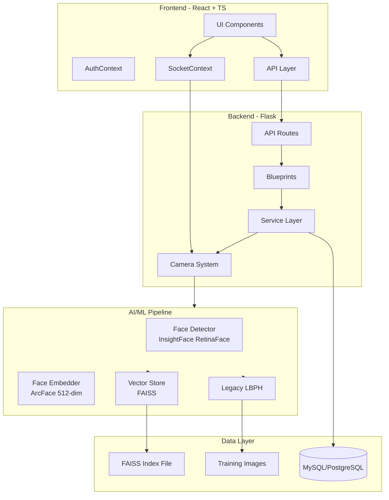
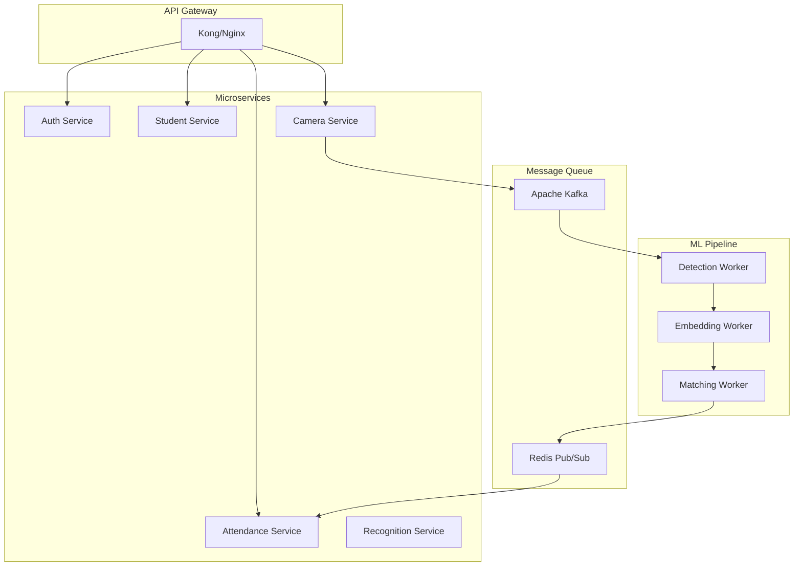

# Đánh Giá Toàn Diện Codebase - Realtime Face Attendance System

**Ngày đánh giá:** 2026-03-03  
**Phiên bản:** 1.0  
**Ngườii đánh giá:** Technical Architect

---

## 📋 Tổng Quan Dự Án

Dự án là một hệ thống điểm danh bằng nhận diện khuôn mặt real-time, sử dụng:
- **Backend:** Flask + Flask-SocketIO + OpenCV + InsightFace
- **Frontend:** React + TypeScript + Material-UI + TanStack Query
- **Database:** MySQL/PostgreSQL với connection pooling
- **AI/ML:** InsightFace (ArcFace) + FAISS vector search + LBPH (legacy)
- **Camera:** Đa luồng xử lý, hỗ trợ USB/RTSP/HTTP/ONVIF

---

## 1. 🏗️ Kiến Trúc Tổng Thể

### 1.1 Đánh Giá Tích Cực ✅

| Khía Cạnh | Đánh Giá |
|-----------|----------|
| **Layer Architecture** | Tốt - Phân tách rõ ràng giữa API, Services, Blueprints |
| **Modular Design** | Tốt - Face recognition module độc lập, dễ test |
| **Plugin Architecture** | Tốt - Camera factory pattern cho phép mở rộng loại camera |
| **Dual Mode Support** | Thông minh - Hỗ trợ cả InsightFace và Legacy (LBPH) |
| **DTO Pattern** | Có áp dụng - `dto_service.py` cung cấp response chuẩn |

### 1.2 Sơ Đồ Kiến Trúc



---

## 2. 🔒 Phân Tích Bảo Mật

### 2.1 Lỗ Hổng CRITICAL 🔴

#### CRITICAL-001: SQL Injection trong AttendanceEngine
**File:** [`cameras/attendance_engine.py`](cameras/attendance_engine.py:138)

```python
# ❌ Vấn đề - string concatenation
cursor.execute(
    """INSERT INTO attendance 
       (person_id, camera_id, date, time, confidence, metadata)
       VALUES (%s, %s, %s, %s, %s, %s)""",
    (...)  # Có parameterization nhưng...
)

# Trong get_attendance():
query = "SELECT * FROM attendance WHERE 1=1"
if date:
    query += " AND date = %s"  # ✅ Đúng
# Nhưng metadata không được sanitize trước khi lưu
```

**Nguy cơ:** Metadata được chuyển thành string mà không validate cấu trúc

**Giải pháp:**
```python
# Validate metadata structure before saving
import json
def validate_metadata(metadata):
    if not isinstance(metadata, dict):
        raise ValueError("Metadata must be a dictionary")
    # Whitelist allowed keys
    allowed_keys = {'bbox', 'confidence', 'processing_time'}
    return {k: v for k, v in metadata.items() if k in allowed_keys}
```

#### CRITICAL-002: Hardcoded Credentials trong RTSP URL
**File:** [`cameras/camera_factory.py`](cameras/camera_factory.py:141)

```python
# ❌ Vấn đề
if self.username and self.password:
    self.url = self.url.replace('rtsp://', 
        f'rtsp://{self.username}:{self.password}@', 1)
```

**Nguy cơ:** Password hiển thị trong logs (mặc dù có `_safe_url_for_log`)

**Giải pháp:**
```python
# Sử dụng environment variables hoặc secrets manager
# Không bao giờ log credentials
```

### 2.2 Lỗ Hổng HIGH 🟠

#### HIGH-001: JWT Token không có Refresh Mechanism
**File:** [`deployment/services/auth_service.py`](deployment/services/auth_service.py:68)

```python
# ❌ Token tồn tại 24 giờ không refresh
token = rt.jwt.encode(
    {
        "user_id": user[0],
        "username": user[1],
        "exp": rt.datetime.utcnow() + rt.timedelta(hours=24),
    },
    ...
)
```

**Giải pháp:**
```python
# Implement refresh token pattern
access_token_expiry = timedelta(minutes=15)
refresh_token_expiry = timedelta(days=7)
```

#### HIGH-002: File Upload không giới hạn kích thước
**File:** [`deployment/services/student_service.py`](deployment/services/student_service.py:119)

```python
# ❌ Không validate file size trước khi đọc
files = rt.request.files.getlist("images")
if len(files) > 20:  # Chỉ check số lượng, không check size
    ...
```

**Giải pháp:**
```python
MAX_FILE_SIZE = 10 * 1024 * 1024  # 10MB
for file in files:
    if len(file.read()) > MAX_FILE_SIZE:
        return error_response("FILE_TOO_LARGE", ...)
```

#### HIGH-003: WebSocket không xác thực
**File:** [`deployment/api.py`](deployment/api.py:703)

```python
# ❌ Không xác thực khi kết nối WebSocket
@socketio.on('connect')
def handle_connect():
    with client_lock:
        connected_clients.add(request.sid)
```

**Giải pháp:**
```python
@socketio.on('connect')
def handle_connect():
    token = request.args.get('token')
    if not validate_token(token):
        return False  # Reject connection
```

### 2.3 Lỗ Hổng MEDIUM 🟡

#### MEDIUM-001: CORS configuration có thể bị bypass
**File:** [`deployment/api.py`](deployment/api.py:89)

```python
# ❌ Cho phép multiple origins trong dev mode
cors_origins = [
    "http://localhost:3000",
    "http://localhost:5173",
    ...
]
```

**Giải pháp:** Sử dụng strict CORS trong production

#### MEDIUM-002: Input Validation chưa đầy đủ
**File:** [`deployment/api.py`](deployment/api.py:279)

```python
# NAME_PATTERN chỉ cho phép letters và spaces
NAME_PATTERN = re.compile(r'^[a-zA-Z\s]+$')  # ❌ Không hỗ trợ Unicode
```

**Giải pháp:**
```python
# Hỗ trợ Unicode names (Tiếng Việt, Chinese, etc.)
NAME_PATTERN = re.compile(r'^[\p{L}\s\-\']+$', re.UNICODE)
```

---

## 3. ⚡ Hiệu Suất & Tối Ưu Hóa

### 3.1 Vấn Đề CRITICAL 🔴

#### CRITICAL-P001: Memory Leak trong FAISS Vector Store
**File:** [`face_recognition/vector_store.py`](face_recognition/vector_store.py:222)

```python
# ❌ Rebuild toàn bộ index khi update/delete
def update(self, student_id, name, embedding):
    # For now, just update metadata
    # Replace in index (FAISS workaround)
    self._index.reset()  # ❌ Xóa toàn bộ
    for e in self._embeddings:  # ❌ Re-add tất cả
        self._index.add(e.reshape(1, -1).astype('float32'))
```

**Vấn đề:** O(n) operation, memory leak với dataset lớn

**Giải pháp:**
```python
# Sử dụng FAISS ID mapping để efficient deletion
import faiss
class VectorStore:
    def __init__(self):
        self._index = faiss.IndexIDMap(faiss.IndexFlatIP(self.EMBEDDING_DIM))
        self._id_map = {}  # student_id -> faiss_id
        self._next_id = 0
    
    def delete(self, student_id):
        if student_id in self._id_map:
            faiss_id = self._id_map[student_id]
            # Đánh dấu deleted (FAISS không hỗ trợ xóa thực)
            self._deleted_ids.add(faiss_id)
            # Periodic rebuild
```

#### CRITICAL-P002: ThreadPool không giới hạn queue size
**File:** [`cameras/frame_processor.py`](cameras/frame_processor.py:64)

```python
# ❌ Không giới hạn queue size
self.executor = ThreadPoolExecutor(max_workers=num_workers)
```

**Giải pháp:**
```python
from queue import Queue
self.executor = ThreadPoolExecutor(
    max_workers=num_workers,
    thread_name_prefix="frame_processor"
)
# Sử dụng Semaphore để giới hạn concurrent tasks
```

### 3.2 Vấn Đề HIGH 🟠

#### HIGH-P001: Không có Backpressure cho Camera Streaming
**File:** [`deployment/api.py`](deployment/api.py:405)

```python
# ❌ Stream frames liên tục không kiểm soát
def on_frame_for_streaming(camera_id, frame):
    # Encode và emit cho tất cả subscribers
    for sid in list(subscribers.keys()):
        socketio.emit('camera_frame', {...}, room=sid)
```

**Giải pháp:**
```python
# Implement rate limiting và adaptive quality
last_emit_time = {}
MIN_EMIT_INTERVAL = 1.0 / STREAM_FPS

def on_frame_for_streaming(camera_id, frame):
    now = time.time()
    if now - last_emit_time.get(camera_id, 0) < MIN_EMIT_INTERVAL:
        return  # Skip frame
    # ... emit
```

#### HIGH-P002: Image Resize không cache
**File:** [`deployment/api.py`](deployment/api.py:421)

```python
# ❌ Resize mỗi frame
if w > FRAME_RESIZE_WIDTH:
    ratio = FRAME_RESIZE_WIDTH / w
    new_w = FRAME_RESIZE_WIDTH
    new_h = int(h * ratio)
    frame = cv2.resize(frame, (new_w, new_h), interpolation=cv2.INTER_AREA)
```

**Giải pháp:** Tính toán ratio một lần, hoặc sử dụng fixed resolutions

### 3.3 Vấn Đề MEDIUM 🟡

#### MEDIUM-P001: Không có Connection Pooling cho HTTP Camera
**File:** [`cameras/camera_factory.py`](cameras/camera_factory.py:223)

```python
# ❌ Tạo connection mới mỗi lần
self.stream = urllib.request.urlopen(self.url, timeout=10)
```

**Giải pháp:** Sử dụng `requests.Session()` hoặc `aiohttp`

---

## 4. 🔧 Khả Năng Bảo Trì & Mở Rộng

### 4.1 Đánh Giá Tích Cực ✅

- **Factory Pattern:** [`CameraFactory`](cameras/camera_factory.py:338) cho phép dễ dàng thêm loại camera mới
- **Strategy Pattern:** Dual mode (InsightFace vs Legacy) implementation
- **Dependency Injection:** Pipeline components có thể mock/test dễ dàng
- **Configuration Centralization:** [`config.py`](face_recognition/config.py) tập trung constants

### 4.2 Vấn Đề Cần Cải Thiện

#### MAINT-001: Code Duplication trong Face Detection
**Files:** 
- [`cameras/frame_processor.py`](cameras/frame_processor.py:214)
- [`deployment/api.py`](deployment/api.py:317)

```python
# Cả hai file đều có logic detect faces tương tự
# Cần centralize vào FaceDetectionService
```

#### MAINT-002: Magic Numbers
**File:** [`cameras/attendance_engine.py`](cameras/attendance_engine.py:30)

```python
# ❌ Magic number
self.dedup_window = dedup_window  # 300 seconds

# Nên là:
DEFAULT_DEDUP_WINDOW_SECONDS = 300  # 5 minutes
```

#### MAINT-003: Inconsistent Error Handling
```python
# Có nơi trả về dict
return {'success': False, 'message': '...'}

# Có nơi raise Exception
raise ValueError('...')

# Có nơi trả về tuple
return False, "error message"
```

---

## 5. 📊 Xử Lý Lỗi, Logging và Validation

### 5.1 Logging ✅ Tốt

- Sử dụng `logging` module chuẩn
- Có RotatingFileHandler để quản lý log size
- Log levels phù hợp (INFO, WARNING, ERROR)

### 5.2 Error Handling ⚠️ Cần Cải Thiện

#### ERROR-001: Silent Failures
**File:** [`face_recognition/vector_store.py`](face_recognition/vector_store.py:159)

```python
except Exception as e:
    logger.error(f"Failed to save index: {e}")
    # ❌ Không raise exception, silent failure
```

#### ERROR-002: Không có Retry Mechanism
```python
# Các external service calls (DB, Camera) nên có retry với exponential backoff
```

### 5.3 Validation ⚠️ Cần Cải Thiện

#### VALID-001: Input Sanitization
```python
# Cần validate thêm:
# - Image dimensions (prevent DoS với ảnh quá lớn)
# - Image format (magic numbers, không chỉ extension)
# - Camera configuration schema validation
```

---

## 6. 📐 SOLID Principles & Clean Code

### 6.1 Đánh Giá Theo SOLID

| Principle | Score | Ghi Chú |
|-----------|-------|---------|
| **Single Responsibility** | 8/10 | Classes có responsibility rõ ràng |
| **Open/Closed** | 7/10 | CameraFactory dễ mở rộng |
| **Liskov Substitution** | 8/10 | BaseCamera abstract class tốt |
| **Interface Segregation** | 6/10 | Có thể tách nhỏ hơn |
| **Dependency Inversion** | 7/10 | Có dependency injection |

### 6.2 Clean Code Issues

#### CLEAN-001: Function Length
**File:** [`cameras/frame_processor.py`](cameras/frame_processor.py:336)

```python
def process_frame(self, camera_id, frame):  # ~150 lines
    # Nên tách thành các helper methods
```

#### CLEAN-002: Commented Code
```python
# Có nhiều đoạn code comment out cần xóa
```

#### CLEAN-003: Type Hints
```python
# Thiếu type hints trong một số nơi, đặc biệt là return types
def get_face_pipeline():  # -> Optional[FaceRecognitionPipeline]
```

---

## 7. 🧪 Testing

### 7.1 Coverage Analysis

**File:** [`tests/test_api.py`](tests/test_api.py)

| Module | Coverage | Đánh Giá |
|--------|----------|----------|
| API Endpoints | ~30% | Cần thêm tests |
| Face Recognition | ~10% | Thiếu tests |
| Camera System | ~5% | Thiếu tests |
| Database | ~20% | Cần thêm tests |

### 7.2 Thiếu Tests Cho

- Concurrency/Race conditions
- Camera reconnection logic
- FAISS index operations
- WebSocket events
- Error scenarios (network failure, disk full, etc.)

---

## 8. 🎯 Đề Xuất Cải Tiến Theo Mức Độ Ưu Tiên

### 8.1 CRITICAL (Thực hiện ngay)

| ID | Vấn Đề | Giải Pháp | Effort |
|----|--------|-----------|--------|
| C001 | FAISS index rebuild O(n) | Implement ID mapping + lazy deletion | 2-3 days |
| C002 | SQL Injection risk | Validate metadata structure | 1 day |
| C003 | WebSocket auth bypass | Add token validation on connect | 1 day |
| C004 | Memory leak in ThreadPool | Add queue size limits | 1 day |

### 8.2 HIGH (Thực hiện trong sprint)

| ID | Vấn Đề | Giải Pháp | Effort |
|----|--------|-----------|--------|
| H001 | JWT refresh mechanism | Implement refresh tokens | 2 days |
| H002 | File upload limits | Add size validation | 0.5 day |
| H003 | Backpressure streaming | Rate limiting + adaptive quality | 2 days |
| H004 | Unicode name support | Update regex patterns | 0.5 day |

### 8.3 MEDIUM (Thực hiện trong quarter)

| ID | Vấn Đề | Giải Pháp | Effort |
|----|--------|-----------|--------|
| M001 | Code duplication | Extract FaceDetectionService | 3 days |
| M002 | Test coverage | Add unit + integration tests | 1 week |
| M003 | Type hints | Add complete type annotations | 2 days |
| M004 | API documentation | OpenAPI/Swagger specs | 2 days |

### 8.4 LOW (Technical debt)

| ID | Vấn Đề | Giải Pháp | Effort |
|----|--------|-----------|--------|
| L001 | Magic numbers | Extract constants | 1 day |
| L002 | Comments cleanup | Remove commented code | 0.5 day |
| L003 | Documentation | Add docstrings | 2 days |

---

## 9. 📈 Kiến Trúc Đề Xuất Tương Lai

### 9.1 Microservices Refactor



### 9.2 Cải Tiến Hiệu Suất

1. **Async Processing:** Chuyển sang `asyncio` cho I/O bound operations
2. **Batch Processing:** Xử lý nhiều frames cùng lúc với GPU batching
3. **Caching:** Redis cache cho frequent queries
4. **CDN:** CloudFront/CloudFlare cho static assets

---

## 10. 📋 Tóm Tắt

### 10.1 Điểm Mạnh ⭐

1. Kiến trúc modular, dễ mở rộng
2. Hỗ trợ đa camera protocols
3. Dual AI mode (InsightFace + Legacy)
4. Real-time streaming với WebSocket
5. Good separation of concerns

### 10.2 Điểm Yếu Cần Cải Thiện ⚠️

1. **Security:** WebSocket auth, input validation
2. **Performance:** FAISS rebuild, memory leaks
3. **Testing:** Coverage thấp, thiếu integration tests
4. **Error Handling:** Silent failures, no retry logic
5. **Documentation:** Thiếu API specs, architecture docs

### 10.3 Risk Assessment

| Risk | Probability | Impact | Mitigation |
|------|-------------|--------|------------|
| Memory leak production | High | High | Implement monitoring + fix C001 |
| Security breach | Medium | Critical | Fix auth issues immediately |
| Performance degradation | Medium | Medium | Add metrics + alerts |
| Data loss | Low | Critical | Regular backups + tests |

---

## 11. ✅ Action Items

### Tuần 1 (CRITICAL fixes)
- [ ] Fix FAISS index rebuild (C001)
- [ ] Add WebSocket authentication (C003)
- [ ] Validate metadata in attendance (C002)

### Tuần 2-3 (HIGH priority)
- [ ] Implement JWT refresh tokens (H001)
- [ ] Add file upload limits (H002)
- [ ] Streaming backpressure (H003)

### Tháng 2 (MEDIUM priority)
- [ ] Refactor FaceDetectionService (M001)
- [ ] Increase test coverage to 70% (M002)
- [ ] Add OpenAPI documentation (M004)

### Ongoing
- [ ] Setup monitoring (Prometheus + Grafana)
- [ ] Regular security audits
- [ ] Performance benchmarking

---

**Kết luận:** Codebase có nền tảng kiến trúc tốt nhưng cần khắc phục các vấn đề bảo mật và hiệu suất trước khi production. Ưu tiên fix các lỗi CRITICAL và HIGH trong 2 tuần tới.
