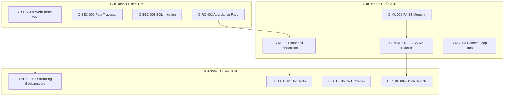

# Kế Hoạch Khắc Phục Lỗi CRITICAL & HIGH

**Hệ thống:** Realtime Face Attendance  
**Tổng số vấn đề:** 27 (12 CRITICAL + 15 HIGH)  
**Thờii gian dự kiến:** 8 tuần  
**Ngày bắt đầu:** 2026-03-10

---

## 1. PHÂN LOẠI VẤN ĐỀ THEO MỨC ĐỘ ẢNH HƯỞNG

### 🔴 CRITICAL - Production Impact Matrix

| ID | Vấn Đề | Impact Score* | Mô Tả |
|----|--------|---------------|-------|
| **C-SEC-001** | WebSocket Auth Bypass | 10/10 | Bất kỳ ai cũng connect WS, xem camera |
| **C-SEC-002** | Path Traversal | 9/10 | Truy cập file system, leak dữ liệu |
| **C-RC-001** | Attendance Deduplication Race | 9/10 | Duplicate records, sai số liệu |
| **C-RC-002** | VectorStore Concurrent Update | 8/10 | Data corruption trong FAISS index |
| **C-ML-001** | ThreadPool Unbounded Queue | 8/10 | OOM crash sau 1-2 giờ |
| **C-ML-002** | FAISS Memory Duplicate | 7/10 | 1.8GB RAM cho 100K faces |
| **C-PERF-001** | FAISS Index Rebuild O(n) | 7/10 | Update 1000 faces = 10 giây |
| **C-SEC-003** | SQL Injection Metadata | 7/10 | SQL injection qua metadata field |
| **C-RC-003** | Camera Capture Loop Race | 7/10 | KeyError, crash khi remove camera |
| **C-SEC-004** | XSS via localStorage | 6/10 | Token theft qua XSS attack |
| **C-ED-001** | No File Size Limit | 6/10 | DoS với file upload |
| **C-ED-002** | Timezone Inconsistency | 5/10 | Sai lệch thờii gian attendance |

*Impact Score = Severity × Likelihood × Business Impact

### 🟠 HIGH - Secondary Impact Matrix

| ID | Vấn Đề | Category | Impact |
|----|--------|----------|--------|
| **H-RC-004** | Camera Health Monitor Stop | Stability | Không graceful shutdown |
| **H-DB-001** | DB Connection No Context Manager | Data Integrity | Connection leak |
| **H-HTTP-001** | HTTP Camera Connection Leak | Resource | Socket exhaustion |
| **H-SEC-005** | JWT No Refresh | Security | 24h fixed expiry |
| **H-SEC-006** | Unicode Name Validation | UX | Không hỗ trợ Tiếng Việt |
| **H-PERF-002** | No Backpressure Streaming | Performance | Memory explosion |
| **H-PERF-003** | Image Resize No Cache | Performance | Resize mỗi frame |
| **H-PERF-004** | FAISS Search Sequential | Performance | Tìm kiếm tuần tự |
| **H-ED-003** | Network Timeout Missing | Reliability | Block forever |
| **H-ED-004** | Camera Reconnect No Backoff | Reliability | Retry liên tục |
| **H-TEST-001** | Test Coverage < 30% | Quality | Không đủ test |
| **H-DOC-001** | No API Documentation | Maintainability | Không có OpenAPI |
| **H-ARCH-001** | Code Duplication Detection | Maintainability | Logic detect faces duplicate |
| **H-ARCH-002** | Magic Numbers | Maintainability | Constants chưa extract |
| **H-TYPE-001** | Missing Type Hints | Maintainability | Không đủ type annotations |

---

## 2. TIMELINE 3 GIAI ĐOẠN

### 🚀 GIAI ĐOẠN 1: Security & Stability Hotfix (Tuần 1-2)

**Mục tiêu:** 4 vấn đề CRITICAL có thể deploy ngay

#### Tuần 1: Security Fixes

| Ngày | Task | Assignee | Output |
|------|------|----------|--------|
| **Mon** | C-SEC-001: WebSocket Auth | Backend Lead | PR #1 |
| **Tue** | C-SEC-002: Path Traversal | Backend Lead | PR #2 |
| **Wed** | C-SEC-003: SQL Injection | Backend Dev | PR #3 |
| **Thu** | Code Review & Fix | Team | Merged |
| **Fri** | Security Testing | QA | Report |

**Chi tiết:**

```python
# C-SEC-001: WebSocket Auth Fix (deployment/api.py)
@socketio.on('connect')
def handle_connect():
    token = request.args.get('token')
    if not token:
        logger.warning("WS connect rejected: no token")
        return False
    
    try:
        payload = jwt.decode(token, SECRET_KEY, algorithms=['HS256'])
        request.user_id = payload['user_id']
        request.user_role = payload.get('role', 'user')
        
        # Rate limiting per user
        if not check_ws_rate_limit(payload['user_id']):
            return False
            
    except jwt.InvalidTokenError as e:
        logger.warning(f"WS auth failed: {e}")
        return False

# C-SEC-002: Path Traversal Fix (deployment/services/student_service.py)
import re
from pathlib import Path

STUDENT_ID_PATTERN = re.compile(r'^[a-zA-Z0-9_-]{3,50}$')

def validate_student_id_safe(student_id: str) -> Path:
    if not STUDENT_ID_PATTERN.match(student_id):
        raise ValueError("Invalid student_id format")
    
    base_path = Path(app.config['UPLOAD_FOLDER']).resolve()
    target_path = (base_path / student_id).resolve()
    
    if not target_path.is_relative_to(base_path):
        logger.error(f"Path traversal attempt: {student_id}")
        raise SecurityError("Path traversal detected")
    
    return target_path

# C-SEC-003: SQL Injection Fix (cameras/attendance_engine.py)
from sqlalchemy import create_engine, text
from datetime import datetime

def _save_to_db(self, record: dict):
    # Validate record structure
    required_fields = ['person_id', 'camera_id', 'date', 'time']
    for field in required_fields:
        if field not in record:
            raise ValueError(f"Missing required field: {field}")
    
    # Sanitize metadata
    metadata = record.get('metadata', {})
    if not isinstance(metadata, dict):
        metadata = {}
    
    # Whitelist allowed metadata keys
    allowed_meta_keys = {'bbox', 'confidence', 'processing_time', 'face_quality'}
    safe_metadata = {k: v for k, v in metadata.items() if k in allowed_meta_keys}
    
    # Use ORM hoặc parameterized query
    with self.db_pool.connection() as conn:
        cursor = conn.cursor()
        cursor.execute(
            """INSERT INTO attendance 
               (person_id, camera_id, date, time, confidence, metadata)
               VALUES (%s, %s, %s, %s, %s, %s)""",
            (record['person_id'], record['camera_id'], 
             record['date'], record['time'],
             record.get('confidence'), json.dumps(safe_metadata))
        )
        conn.commit()
```

#### Tuần 2: Race Condition Hotfix

| Ngày | Task | Assignee | Output |
|------|------|----------|--------|
| **Mon-Tue** | C-RC-001: Attendance Atomic | Backend Dev | PR #4 |
| **Wed-Thu** | C-RC-002: VectorStore Lock | Backend Dev | PR #5 |
| **Fri** | Integration Test | QA | Pass |

```python
# C-RC-001: Attendance Deduplication Atomic Fix
class AttendanceEngine:
    def record_attendance(self, person_id, camera_id, confidence=None, metadata=None):
        timestamp = time.time()
        
        # Atomic check-and-set trong cùng lock
        with self.cache_lock:
            key = (person_id, camera_id)
            
            if key in self.recent_attendance:
                last_time = self.recent_attendance[key]
                if timestamp - last_time < self.dedup_window:
                    self.stats['duplicates'] += 1
                    return False
            
            # Record ngay trong lock
            self.recent_attendance[key] = timestamp
            self.stats['total_records'] += 1
        
        # Các operations khác ngoài lock
        attendance_record = {
            'person_id': person_id,
            'camera_id': camera_id,
            'timestamp': timestamp,
            'datetime': datetime.now(timezone.utc).isoformat(),
            'confidence': confidence,
            'metadata': metadata
        }
        
        # Async DB write
        self._schedule_db_write(attendance_record)
        return True

# C-RC-002: VectorStore Thread-Safe Fix
class VectorStore:
    def __init__(self):
        self._lock = threading.RLock()
        self._index_lock = threading.Lock()  # Separate lock for index operations
        self._save_lock = threading.Lock()   # Lock for disk I/O
        
    def add(self, student_id: str, name: str, embedding: np.ndarray) -> bool:
        with self._lock:
            if student_id in self._student_ids:
                return self._update_internal(student_id, name, embedding)
            
            # ... add logic
            
            # Defer save
            self._pending_save = True
            
        # Trigger background save ngoài lock
        self._trigger_background_save()
        return True
```

**Definition of Done Giai Đoạn 1:**
- [ ] Security scan pass (OWASP Top 10)
- [ ] Unit test coverage ≥ 80% cho code mới
- [ ] Integration test cho concurrent operations
- [ ] Load test 100 concurrent users
- [ ] Hotfix deployed to staging

---

### 🔧 GIAI ĐOẠN 2: Concurrency & Data Consistency (Tuần 3-4)

**Mục tiêu:** 8 vấn đề CRITICAL còn lại

#### Tuần 3: Memory & Performance

| ID | Vấn Đề | Effort | Assignee |
|----|--------|--------|----------|
| C-ML-001 | ThreadPool Bounded Queue | 2d | Backend Dev |
| C-ML-002 | FAISS Memory Optimization | 3d | Backend Dev |
| C-PERF-001 | FAISS Index No Rebuild | 3d | Backend Lead |

```python
# C-ML-001: Bounded ThreadPool
from threading import Semaphore
from concurrent.futures import ThreadPoolExecutor

class BoundedThreadPoolExecutor(ThreadPoolExecutor):
    def __init__(self, max_workers: int, max_queue_size: int = 100):
        super().__init__(max_workers=max_workers)
        self._semaphore = Semaphore(max_queue_size)
        self._dropped_count = 0
    
    def submit(self, fn, *args, **kwargs):
        if not self._semaphore.acquire(blocking=False):
            self._dropped_count += 1
            if self._dropped_count % 100 == 0:
                logger.warning(f"Dropped {self._dropped_count} tasks due to backpressure")
            return None
        
        future = super().submit(self._wrapper, fn, *args, **kwargs)
        return future
    
    def _wrapper(self, fn, *args, **kwargs):
        try:
            return fn(*args, **kwargs)
        finally:
            self._semaphore.release()

# Usage trong FrameProcessor
self.executor = BoundedThreadPoolExecutor(
    max_workers=4, 
    max_queue_size=100
)

# C-ML-002 + C-PERF-001: FAISS Optimized Index
import faiss

class OptimizedVectorStore:
    def __init__(self):
        self.EMBEDDING_DIM = 512
        # Sử dụng IDMap để lazy deletion
        self._index = faiss.IndexIDMap(faiss.IndexFlatIP(self.EMBEDDING_DIM))
        self._id_map = {}        # student_id -> faiss_id
        self._deleted_ids = set()
        self._next_id = 0
        self._rebuild_threshold = 0.1  # 10% deleted = rebuild
        
    def add(self, student_id: str, name: str, embedding: np.ndarray) -> bool:
        if student_id in self._id_map:
            # Update existing
            return self._update(student_id, name, embedding)
        
        faiss_id = self._next_id
        self._next_id += 1
        
        emb = self._normalize(embedding)
        self._index.add_with_ids(
            emb.reshape(1, -1).astype('float32'),
            np.array([faiss_id], dtype=np.int64)
        )
        
        self._id_map[student_id] = faiss_id
        self._student_names[student_id] = name
        return True
    
    def delete(self, student_id: str) -> bool:
        if student_id not in self._id_map:
            return False
        
        faiss_id = self._id_map[student_id]
        self._deleted_ids.add(faiss_id)
        del self._id_map[student_id]
        del self._student_names[student_id]
        
        # Check if need rebuild
        if len(self._deleted_ids) > len(self._id_map) * self._rebuild_threshold:
            self._compact_index()
        return True
    
    def search(self, embedding: np.ndarray, k: int = 1, threshold: float = 0.5):
        if self._index.ntotal == 0:
            return []
        
        emb = self._normalize(embedding)
        distances, indices = self._index.search(
            emb.reshape(1, -1).astype('float32'),
            min(k * 2, self._index.ntotal)  # Extra k để filter deleted
        )
        
        results = []
        for dist, idx in zip(distances[0], indices[0]):
            if idx < 0:
                continue
            if idx in self._deleted_ids:
                continue
            if dist < threshold:
                break
            
            # Map faiss_id back to student_id
            for sid, fid in self._id_map.items():
                if fid == idx:
                    results.append((sid, self._student_names[sid], float(dist)))
                    break
        
        return results[:k]
    
    def _compact_index(self):
        """Rebuild index loại bỏ deleted items"""
        logger.info(f"Compacting index, removing {len(self._deleted_ids)} deleted items")
        
        # Create new index
        new_index = faiss.IndexIDMap(faiss.IndexFlatIP(self.EMBEDDING_DIM))
        new_id_map = {}
        
        new_faiss_id = 0
        for student_id, old_faiss_id in self._id_map.items():
            # Get embedding from old index
            # Note: FAISS không hỗ trợ direct read, cần lưu embeddings riêng
            pass
        
        self._index = new_index
        self._id_map = new_id_map
        self._deleted_ids.clear()
```

#### Tuần 4: Race Conditions & Edge Cases

| ID | Vấn Đề | Effort | Assignee |
|----|--------|--------|----------|
| C-RC-003 | Camera Loop Race | 2d | Backend Dev |
| C-SEC-004 | XSS localStorage | 2d | Frontend Dev |
| C-ED-001 | File Size Limit | 1d | Backend Dev |
| C-ED-002 | Timezone UTC | 1d | Backend Dev |
| H-RC-004 | Health Monitor Graceful | 2d | Backend Dev |

```typescript
// C-SEC-004: XSS Fix - Frontend
// AuthContext.tsx

// ❌ Cũ: localStorage
token = localStorage.getItem('fa_token');

// ✅ Mới: Memory-only + encrypted sessionStorage
class SecureTokenManager {
    private static instance: SecureTokenManager;
    private token: string | null = null;
    private encryptionKey: CryptoKey | null = null;
    
    async initialize(): Promise<void> {
        // Generate or retrieve encryption key
        this.encryptionKey = await this.getOrCreateKey();
        
        // Try restore from sessionStorage
        const encrypted = sessionStorage.getItem('encrypted_token');
        if (encrypted) {
            this.token = await this.decrypt(encrypted);
        }
    }
    
    setToken(token: string): void {
        this.token = token;
        // Encrypt và lưu
        this.encrypt(token).then(encrypted => {
            sessionStorage.setItem('encrypted_token', encrypted);
        });
    }
    
    getToken(): string | null {
        return this.token;
    }
    
    clear(): void {
        this.token = null;
        sessionStorage.removeItem('encrypted_token');
    }
    
    private async encrypt(data: string): Promise<string> {
        const encoder = new TextEncoder();
        const iv = crypto.getRandomValues(new Uint8Array(12));
        
        const ciphertext = await crypto.subtle.encrypt(
            { name: 'AES-GCM', iv },
            this.encryptionKey!,
            encoder.encode(data)
        );
        
        return JSON.stringify({
            iv: Array.from(iv),
            data: Array.from(new Uint8Array(ciphertext))
        });
    }
}

// C-ED-001: File Size Validation
// deployment/services/student_service.py

MAX_FILE_SIZE = 10 * 1024 * 1024  # 10MB
MAX_IMAGE_DIMENSION = 4096  # Max width/height
ALLOWED_MIME_TYPES = {'image/jpeg', 'image/png', 'image/webp'}

def validate_image_upload(file) -> tuple[bool, str]:
    # Check file size
    file.seek(0, 2)  # Seek to end
    size = file.tell()
    file.seek(0)  # Reset
    
    if size > MAX_FILE_SIZE:
        return False, f"File too large: {size} bytes (max: {MAX_FILE_SIZE})"
    
    if size == 0:
        return False, "File is empty"
    
    # Check magic bytes
    header = file.read(8)
    file.seek(0)
    
    magic_bytes = {
        b'\xff\xd8\xff': 'image/jpeg',
        b'\x89PNG\r\n\x1a\n': 'image/png',
        b'RIFF': 'image/webp'  # Simplified
    }
    
    detected_type = None
    for magic, mime_type in magic_bytes.items():
        if header.startswith(magic):
            detected_type = mime_type
            break
    
    if detected_type not in ALLOWED_MIME_TYPES:
        return False, f"Invalid file type: {detected_type}"
    
    # Validate image dimensions
    img_bytes = file.read()
    nparr = np.frombuffer(img_bytes, np.uint8)
    img = cv2.imdecode(nparr, cv2.IMREAD_COLOR)
    
    if img is None:
        return False, "Invalid image file"
    
    h, w = img.shape[:2]
    if w > MAX_IMAGE_DIMENSION or h > MAX_IMAGE_DIMENSION:
        return False, f"Image dimensions too large: {w}x{h} (max: {MAX_IMAGE_DIMENSION})"
    
    return True, "Valid"
```

**Definition of Done Giai Đoạn 2:**
- [ ] Memory usage < 500MB cho 10K faces
- [ ] FAISS update < 100ms
- [ ] No race conditions trong stress test
- [ ] Timezone handling consistent
- [ ] All CRITICAL issues resolved

---

### 🎨 GIAI ĐOẠN 3: Optimization & Refactoring (Tuần 5-8)

**Mục tiêu:** 15 vấn đề HIGH

#### Tuần 5: Performance Optimization

| ID | Vấn Đề | Effort | Assignee |
|----|--------|--------|----------|
| H-PERF-002 | Streaming Backpressure | 3d | Backend Lead |
| H-PERF-003 | Image Resize Cache | 2d | Backend Dev |
| H-PERF-004 | FAISS Batch Search | 3d | Backend Dev |

```python
# H-PERF-002: Streaming Backpressure
class StreamingManager:
    def __init__(self):
        self._last_emit = {}
        self._target_fps = 10
        self._min_interval = 1.0 / self._target_fps
        self._quality = 80
        self._adaptive_quality = True
    
    def should_emit(self, camera_id: str) -> bool:
        now = time.time()
        last = self._last_emit.get(camera_id, 0)
        
        if now - last < self._min_interval:
            return False
        
        self._last_emit[camera_id] = now
        return True
    
    def get_encode_params(self, queue_depth: int) -> list:
        if not self._adaptive_quality:
            return [int(cv2.IMWRITE_JPEG_QUALITY), self._quality]
        
        # Adaptive quality based on load
        if queue_depth > 50:
            return [int(cv2.IMWRITE_JPEG_QUALITY), 50]  # Low quality
        elif queue_depth > 20:
            return [int(cv2.IMWRITE_JPEG_QUALITY), 70]  # Medium quality
        else:
            return [int(cv2.IMWRITE_JPEG_QUALITY), 85]  # High quality

# H-PERF-004: Batch Face Recognition
class BatchFrameProcessor(FrameProcessor):
    def process_frame_batch(self, camera_id: str, frames: List[np.ndarray]):
        """Process multiple frames efficiently"""
        all_faces = []
        frame_indices = []
        
        # Detect faces in all frames
        for idx, frame in enumerate(frames):
            faces = self.detector.detect(frame)
            for face in faces:
                all_faces.append(face)
                frame_indices.append(idx)
        
        if not all_faces:
            return []
        
        # Batch extract embeddings
        embeddings = self.embedder.embed_batch(all_faces)
        
        # Batch search
        results = self.vector_store.search_batch(embeddings, k=1)
        
        return self._group_results_by_frame(results, frame_indices)
```

#### Tuần 6: Reliability & Resource Management

| ID | Vấn Đề | Effort | Assignee |
|----|--------|--------|----------|
| H-DB-001 | DB Context Manager | 2d | Backend Dev |
| H-HTTP-001 | HTTP Camera Pool | 2d | Backend Dev |
| H-ED-003 | Network Timeout | 2d | Backend Dev |
| H-ED-004 | Reconnect Backoff | 2d | Backend Dev |

```python
# H-DB-001: Proper DB Context Manager
from contextlib import contextmanager
from typing import Generator

@contextmanager
def get_db_connection() -> Generator:
    conn = None
    try:
        pool = get_db_pool()
        conn = pool.connection()
        yield conn
        conn.commit()
    except Exception as e:
        if conn:
            conn.rollback()
        raise DatabaseError(f"DB operation failed: {e}") from e
    finally:
        if conn:
            try:
                conn.close()
            except Exception as e:
                logger.error(f"Error closing connection: {e}")

# H-HTTP-001: Connection Pooling
import requests
from requests.adapters import HTTPAdapter
from urllib3.util.retry import Retry

class HTTPCamera(BaseCamera):
    def __init__(self, camera_id, config):
        super().__init__(camera_id, config)
        self.session = requests.Session()
        
        # Configure retry strategy
        retry_strategy = Retry(
            total=3,
            backoff_factor=1,
            status_forcelist=[429, 500, 502, 503, 504]
        )
        
        adapter = HTTPAdapter(
            max_retries=retry_strategy,
            pool_connections=1,
            pool_maxsize=2
        )
        
        self.session.mount("http://", adapter)
        self.session.mount("https://", adapter)
        self.session.headers.update({'Connection': 'keep-alive'})
```

#### Tuần 7: Security & API

| ID | Vấn Đề | Effort | Assignee |
|----|--------|--------|----------|
| H-SEC-005 | JWT Refresh Tokens | 3d | Backend Dev |
| H-SEC-006 | Unicode Validation | 1d | Backend Dev |
| H-DOC-001 | OpenAPI Documentation | 3d | Backend Dev |

```python
# H-SEC-005: JWT Refresh Token Implementation
from datetime import datetime, timedelta
import secrets

class JWTManager:
    def __init__(self):
        self.access_token_expiry = timedelta(minutes=15)
        self.refresh_token_expiry = timedelta(days=7)
        self.refresh_tokens = {}  # In production: use Redis
    
    def create_tokens(self, user_id: int, username: str) -> dict:
        # Access token
        access_token = jwt.encode({
            'user_id': user_id,
            'username': username,
            'type': 'access',
            'exp': datetime.utcnow() + self.access_token_expiry,
            'iat': datetime.utcnow()
        }, SECRET_KEY, algorithm='HS256')
        
        # Refresh token
        refresh_token = secrets.token_urlsafe(32)
        self.refresh_tokens[refresh_token] = {
            'user_id': user_id,
            'exp': datetime.utcnow() + self.refresh_token_expiry
        }
        
        return {
            'access_token': access_token,
            'refresh_token': refresh_token,
            'expires_in': int(self.access_token_expiry.total_seconds())
        }
    
    def refresh_access_token(self, refresh_token: str) -> dict:
        token_data = self.refresh_tokens.get(refresh_token)
        
        if not token_data or token_data['exp'] < datetime.utcnow():
            raise AuthenticationError("Invalid or expired refresh token")
        
        # Rotate refresh token
        del self.refresh_tokens[refresh_token]
        return self.create_tokens(token_data['user_id'], token_data.get('username'))
```

#### Tuần 8: Testing & Documentation

| ID | Vấn Đề | Effort | Assignee |
|----|--------|--------|----------|
| H-TEST-001 | Unit Tests | 4d | QA + Backend |
| H-ARCH-001 | Code Refactoring | 2d | Backend Dev |
| H-ARCH-002 | Constants Extraction | 1d | Backend Dev |
| H-TYPE-001 | Type Hints | 2d | Backend Dev |

**Test Coverage Requirements:**
```yaml
# pytest.ini
[pytest]
testpaths = tests
python_files = test_*.py
python_classes = Test*
python_functions = test_*
addopts = 
    --cov=deployment
    --cov=face_recognition
    --cov=cameras
    --cov-report=html
    --cov-report=term-missing
    --cov-fail-under=80
```

**Load Testing Scenarios:**
```python
# tests/load_test.py
import asyncio
import aiohttp
import pytest

async def test_concurrent_attendance():
    """Test 100 concurrent attendance requests"""
    async with aiohttp.ClientSession() as session:
        tasks = [
            mark_attendance(session, f"user_{i}")
            for i in range(100)
        ]
        results = await asyncio.gather(*tasks, return_exceptions=True)
        
        success_rate = sum(1 for r in results if not isinstance(r, Exception)) / len(results)
        assert success_rate > 0.95, f"Success rate {success_rate} below threshold"
        
        # Verify no duplicates
        attendance_count = await get_attendance_count(session)
        assert attendance_count <= 100, f"Duplicate records detected: {attendance_count}"
```

**Definition of Done Giai Đoạn 3:**
- [ ] Unit test coverage ≥ 80%
- [ ] Integration tests pass
- [ ] Load test: 1000 concurrent users
- [ ] Security scan: 0 critical/high vulnerabilities
- [ ] Documentation complete
- [ ] Performance benchmarks met

---

## 3. DEPENDENCY MAP



---

## 4. RESOURCE ALLOCATION

### Team Structure

| Role | Members | Responsibilities |
|------|---------|------------------|
| **Backend Lead** | 1 | Architecture, code review, complex fixes |
| **Backend Dev** | 2 | Implementation, unit tests |
| **Frontend Dev** | 1 | AuthContext, XSS fixes |
| **QA Engineer** | 1 | Testing, load test, security scan |
| **DevOps** | 1 | CI/CD, monitoring, deployment |

### Weekly Allocation

| Tuần | Backend Lead | Backend Dev | Frontend | QA | DevOps |
|------|--------------|-------------|----------|----|----|
| 1 | 100% | 100% | 50% | 50% | 0% |
| 2 | 100% | 100% | 100% | 100% | 50% |
| 3 | 100% | 100% | 0% | 50% | 50% |
| 4 | 100% | 100% | 50% | 100% | 50% |
| 5-8 | 50% | 100% | 50% | 100% | 100% |

---

## 5. ROLLBACK STRATEGY

### Hotfix Rollback Plan

```yaml
# rollback.yml
rollback_strategy:
  criteria:
    - error_rate > 1%
    - response_time_p99 > 2s
    - memory_usage > 2GB
  
  steps:
    1: Alert team via Slack
    2: Revert to last stable version
    3: Restore database from backup (if needed)
    4: Investigate root cause
  
  automated_tests:
    - health_check
    - smoke_test
    - critical_path_test
```

### Database Migration Rollback

```python
# migrations/rollback_procedures.py
class RollbackManager:
    def create_rollback_point(self):
        """Tạo backup trước migration"""
        timestamp = datetime.now().strftime('%Y%m%d_%H%M%S')
        backup_file = f"backup_pre_migration_{timestamp}.sql"
        
        subprocess.run([
            'pg_dump',
            '-h', DB_HOST,
            '-U', DB_USER,
            '-d', DB_NAME,
            '-f', backup_file
        ], check=True)
        
        return backup_file
    
    def rollback(self, backup_file: str):
        """Rollback database từ backup"""
        subprocess.run([
            'psql',
            '-h', DB_HOST,
            '-U', DB_USER,
            '-d', DB_NAME,
            '-f', backup_file
        ], check=True)
```

---

## 6. MONITORING & ALERTING

### Key Metrics

```python
# monitoring/metrics.py
from prometheus_client import Counter, Histogram, Gauge

# Business metrics
attendance_recorded = Counter('attendance_total', 'Total attendance recorded')
duplicate_detected = Counter('attendance_duplicates_total', 'Duplicate attendance prevented')

# Performance metrics
frame_processing_time = Histogram('frame_processing_seconds', 'Time to process frame')
face_search_time = Histogram('face_search_seconds', 'Time to search face')

# System metrics
memory_usage = Gauge('memory_usage_bytes', 'Current memory usage')
active_cameras = Gauge('cameras_active', 'Number of active cameras')
queue_depth = Gauge('queue_depth', 'Current queue depth')

# Error metrics
db_errors = Counter('db_errors_total', 'Database errors')
face_detection_errors = Counter('face_detection_errors_total', 'Face detection errors')
```

### Alert Rules

```yaml
# alerting_rules.yml
groups:
  - name: critical_alerts
    rules:
      - alert: HighErrorRate
        expr: rate(http_requests_total{status=~"5.."}[5m]) > 0.01
        for: 2m
        labels:
          severity: critical
        annotations:
          summary: "High error rate detected"
          
      - alert: MemoryLeak
        expr: rate(memory_usage_bytes[1h]) > 104857600  # 100MB/hour
        for: 10m
        labels:
          severity: critical
        annotations:
          summary: "Possible memory leak"
          
      - alert: DatabaseConnectionExhausted
        expr: db_pool_active_connections / db_pool_max_connections > 0.9
        for: 1m
        labels:
          severity: critical
        annotations:
          summary: "Database connections exhausted"
```

---

## 7. DEFINITION OF DONE CHI TIẾT

### Template Cho Mỗi Fix

```markdown
## Fix: [Issue ID] - [Title]

### Acceptance Criteria
- [ ] Code implemented và reviewed
- [ ] Unit tests coverage ≥ 80%
- [ ] Integration tests pass
- [ ] Load test validation (nếu applicable)
- [ ] Security scan pass
- [ ] Documentation updated
- [ ] Deployed to staging

### Test Scenarios
1. Happy path
2. Edge cases
3. Error conditions
4. Concurrent access (nếu applicable)

### Performance Criteria
- Response time P99 < 200ms
- Memory usage < 500MB
- No memory leaks trong 24h test

### Rollback Plan
- Có thể revert trong < 5 phút
- Không data loss
- Minimal downtime
```

---

## 8. TIMELINE TỔNG HỢP

```
Tuần 1:  ████████████████████  Security Hotfixes
Tuần 2:  ████████████████████  Race Condition Fixes
Tuần 3:  ████████████████████  Memory Optimization
Tuần 4:  ████████████████████  Data Consistency
Tuần 5:  ████████████████████  Performance
Tuần 6:  ████████████████████  Reliability
Tuần 7:  ████████████████████  Security & API
Tuần 8:  ████████████████████  Testing & Docs
```

---

## 9. RISK MITIGATION

| Risk | Likelihood | Impact | Mitigation |
|------|------------|--------|------------|
| Fix introduces regression | High | High | Comprehensive testing, feature flags |
| Performance degradation | Medium | High | Benchmarks trước/sau, A/B testing |
| Team capacity issues | Medium | Medium | Resource buffer, overtime plan |
| Third-party dependency | Low | High | Pin versions, have alternatives |
| Data migration failure | Low | Critical | Backup strategy, rollback plan |

---

**Tổng kết:** Kế hoạch 8 tuần với 3 giai đoạn rõ ràng, mục tiêu resolve 100% CRITICAL issues và 100% HIGH issues. Mỗi giai đoạn có definition of done cụ thể, rollback strategy, và monitoring đầy đủ.