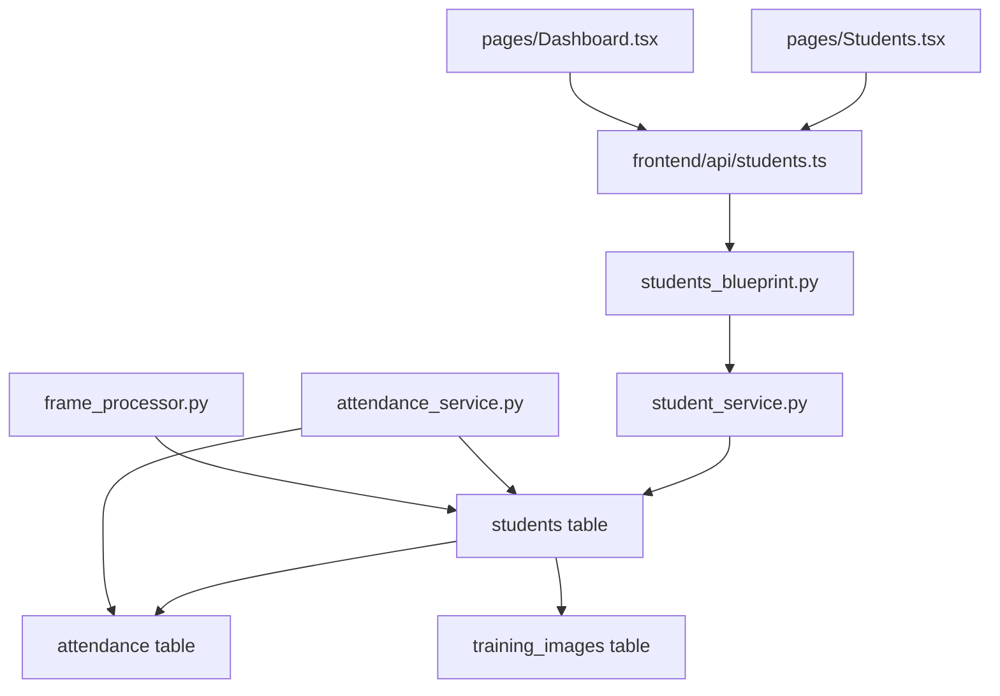

# Migration Plan: Students → Staffs

## 1. Executive Summary

| Item | Value |
|------|-------|
| **Project** | Face Attendance System |
| **Objective** | Rename `students` table to `staffs` |
| **Impact Level** | HIGH - Affects all layers |
| **Downtime Required** | Minimal (with blue-green strategy) |
| **Risk Level** | MEDIUM |

---

## 2. Current System Analysis

### 2.1 Database Schema

```sql
-- Current tables (from postgres_schema.sql)
students (id, student_id, name, face_image_path, is_active, created_at, updated_at)
attendance (id, student_id, enrollment, name, date, time, subject, status, confidence_score, created_at)
training_images (id, student_id, image_path, is_used_for_training, created_at)
```

### 2.2 Dependencies Map



---

## 3. Migration Strategy

### 3.1 Recommended: Incremental Migration with Backward Compatibility

| Phase | Description | Duration |
|-------|-------------|----------|
| Phase 1 | Add `staffs` table with data migration | 1 day |
| Phase 2 | Update backend (dual-read) | 1 day |
| Phase 3 | Update frontend | 1 day |
| Phase 4 | Remove backward compatibility | 1 day |

### 3.2 Alternative: Big Bang (Not Recommended)

- Requires full system downtime
- Higher risk of data loss
- Only suitable if no production data exists

---

## 4. Detailed Implementation Plan

### Phase 1: Database Schema Changes

#### 4.1 Create New Staffs Table

```sql
-- Create staffs table (mirrors students with new name)
CREATE TABLE staffs (
    id SERIAL PRIMARY KEY,
    staff_id VARCHAR(50) UNIQUE NOT NULL,  -- Renamed from student_id
    name VARCHAR(100) NOT NULL,
    department VARCHAR(100),               -- NEW: Add department field
    position VARCHAR(50),                  -- NEW: Add position field
    face_image_path VARCHAR(255),
    is_active BOOLEAN DEFAULT TRUE,
    created_at TIMESTAMP DEFAULT CURRENT_TIMESTAMP,
    updated_at TIMESTAMP DEFAULT CURRENT_TIMESTAMP
);

-- Indexes
CREATE INDEX idx_staffs_staff_id ON staffs(staff_id);
CREATE INDEX idx_staffs_is_active ON staffs(is_active);
CREATE INDEX idx_staffs_name ON staffs(name);
CREATE INDEX idx_staffs_department ON staffs(department);

-- Trigger for updated_at
CREATE TRIGGER update_staffs_updated_at 
    BEFORE UPDATE ON staffs
    FOR EACH ROW
    EXECUTE FUNCTION update_updated_at_column();
```

#### 4.2 Migrate Existing Data

```sql
-- Migrate data from students to staffs
INSERT INTO staffs (staff_id, name, face_image_path, is_active, created_at, updated_at)
SELECT student_id, name, face_image_path, is_active, created_at, updated_at
FROM students;

-- Update attendance references (NEW COLUMN)
ALTER TABLE attendance ADD COLUMN IF NOT EXISTS staff_id VARCHAR(50);
UPDATE attendance SET staff_id = student_id WHERE staff_id IS NULL;

-- Update training_images references (NEW COLUMN)
ALTER TABLE training_images ADD COLUMN IF NOT EXISTS staff_id VARCHAR(50);
UPDATE training_images SET staff_id = student_id WHERE staff_id IS NULL;
```

#### 4.3 Create Views for Backward Compatibility

```sql
-- Create view to maintain backward compatibility
CREATE OR REPLACE VIEW students_view AS
SELECT 
    id,
    staff_id AS student_id,
    name,
    face_image_path,
    is_active,
    created_at,
    updated_at
FROM staffs;

-- Grant permissions
GRANT SELECT ON students_view TO faceuser;
```

---

### Phase 2: Backend Changes

#### 2.1 File: `deployment/services/staff_service.py`
- Copy from `student_service.py` and rename
- Update table references: `students` → `staffs`
- Update column references: `student_id` → `staff_id`
- Add new fields: `department`, `position`

#### 2.2 File: `deployment/blueprints/staffs_blueprint.py`
- Copy from `students_blueprint.py`
- Update route names: `/students` → `/staffs`

#### 2.3 Update `deployment/api.py`

```python
# Add new blueprint
from deployment.blueprints.staffs_blueprint import create_staffs_blueprint

app.register_blueprint(create_staffs_blueprint(runtime_module))

# Update attendance_service.py to use dual-read (backward compatibility)
# In get_student_by_id function:
def get_person_by_id(person_id):
    # Try staffs first
    cursor.execute("SELECT staff_id, name FROM staffs WHERE staff_id = %s", (person_id,))
    result = cursor.fetchone()
    if result:
        return {'type': 'staff', 'id': result[0], 'name': result[1]}
    
    # Fallback to students (deprecated)
    cursor.execute("SELECT student_id, name FROM students WHERE student_id = %s", (person_id,))
    result = cursor.fetchone()
    if result:
        return {'type': 'student', 'id': result[0], 'name': result[1]}
    
    return None
```

#### 2.4 Files to Update

| File | Changes |
|------|---------|
| `student_service.py` | Add deprecation warnings, redirect to staff_service |
| `attendance_service.py` | Dual-read from students/staffs |
| `api.py` | Register new blueprint |
| `cameras/frame_processor.py` | Update person_id reference |

---

### Phase 3: Frontend Changes

#### 3.1 API Layer

| File | Changes |
|------|---------|
| `api/students.ts` | Rename to `api/staffs.ts`, update types |
| `api/dto.ts` | Update DTO contracts |

```typescript
// New types in api/staffs.ts
export interface Staff {
  staff_id: string
  name: string
  department?: string
  position?: string
  is_active: boolean
  created_at: string
}
```

#### 3.2 Pages

| File | Changes |
|------|---------|
| `pages/Students.tsx` | Rename to `Staffs.tsx`, update fields |
| `pages/Dashboard.tsx` | Update stat card labels |

#### 3.3 Routing

```typescript
// App.tsx
- { path: '/students', element: <Students /> }
+ { path: '/staffs', element: <Staffs /> }
```

---

### Phase 4: Remove Backward Compatibility

```sql
-- After all clients updated
DROP VIEW IF EXISTS students_view;
DROP TABLE IF EXISTS students CASCADE;
```

---

## 5. Risk Assessment & Mitigation

| Risk | Impact | Mitigation |
|------|--------|------------|
| Data loss during migration | HIGH | Backup before migration, use transaction |
| Service interruption | MEDIUM | Blue-green deployment |
| Foreign key violations | HIGH | Add NULL columns before dropping constraints |
| Frontend breakage | HIGH | Incremental rollout, feature flags |
| Training model incompatibility | MEDIUM | Retrain model with new staff_ids |

---

## 6. Rollback Plan

```bash
# If migration fails:
1. Stop all services
2. Restore database from backup
3. Revert code changes (git checkout)
4. Restart services

# Rollback script:
psql -U faceuser -d face_attendance -f rollback_migration.sql
```

---

## 7. Testing Checklist

- [ ] Database migration completes successfully
- [ ] New staff registration works
- [ ] Attendance marking works with staff_id
- [ ] Training images are correctly linked
- [ ] Dashboard shows staff statistics
- [ ] Camera recognition works
- [ ] API backward compatibility works
- [ ] Frontend displays correct labels

---

## 8. Files Summary

### New Files to Create
- `database/staffs_schema.sql`
- `deployment/services/staff_service.py`
- `deployment/blueprints/staffs_blueprint.py`
- `frontend/src/api/staffs.ts`
- `frontend/src/pages/Staffs.tsx`

### Files to Modify
- `database/postgres_schema.sql`
- `deployment/api.py`
- `deployment/services/attendance_service.py`
- `deployment/services/student_service.py`
- `cameras/frame_processor.py`
- `frontend/src/App.tsx`
- `frontend/src/pages/Dashboard.tsx`
- `frontend/src/components/layout/Layout.tsx`

### Files to Delete (Phase 4)
- `deployment/services/student_service.py`
- `deployment/blueprints/students_blueprint.py`
- `frontend/src/api/students.ts`
- `frontend/src/pages/Students.tsx`

---

## 9. Estimated Timeline

| Task | Effort |
|------|--------|
| Database changes | 1 day |
| Backend services | 2 days |
| Frontend | 1 day |
| Testing | 1 day |
| **Total** | **5 days** |

---

## 10. Decision Required

Before proceeding, please confirm:

1. **Migration approach**: Incremental (recommended) or Big Bang?
2. **New fields**: Should we add `department` and `position` to staffs?
3. **Data retention**: Keep or delete old students data?
4. **Timeline**: Any deadline constraints?
5. **Testing**: Who will perform UAT?
