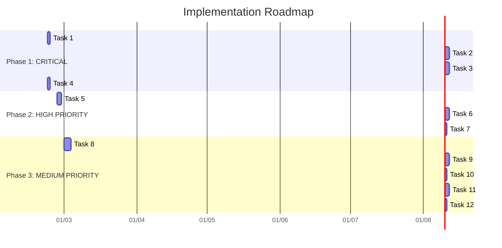

# KẾ HOẠCH THỰC HIỆN DỰ ÁN
## Realtime Face Attendance System - Implementation Roadmap

---

## TỔNG QUAN KẾ HOẠCH

Dự án được chia thành **3 Giai đoạn** với **12 Task chính**:



---

## PHASE 1: CRITICAL FIXES (Ngày 1-6)

### Task 1: Fix Database Schema
**Priority**: 🔴 CRITICAL | **Estimated**: 1 ngày

**File cần sửa**: `database/init_db.sql`

**Nội dung**:
```sql
-- Sửa database/init_db.sql
CREATE DATABASE IF NOT EXISTS face_attendance;  -- Thống nhất tên
USE face_attendance;

-- Tạo bảng users cho authentication
CREATE TABLE IF NOT EXISTS users (
    id INT PRIMARY KEY AUTO_INCREMENT,
    username VARCHAR(50) UNIQUE NOT NULL,
    password_hash VARCHAR(255) NOT NULL,
    created_at TIMESTAMP DEFAULT CURRENT_TIMESTAMP
);

-- Tạo bảng students
CREATE TABLE IF NOT EXISTS students (
    id INT PRIMARY KEY AUTO_INCREMENT,
    student_id VARCHAR(50) UNIQUE NOT NULL,
    name VARCHAR(100) NOT NULL,
    face_image_path VARCHAR(255),
    created_at TIMESTAMP DEFAULT CURRENT_TIMESTAMP
);

-- Giữ nguyên bảng Attendance
CREATE TABLE IF NOT EXISTS Attendance (
    ID INT PRIMARY KEY AUTO_INCREMENT,
    student_id VARCHAR(50) NOT NULL,
    enrollment VARCHAR(100),
    name VARCHAR(50),
    date VARCHAR(20) NOT NULL,
    time VARCHAR(20) NOT NULL,
    subject VARCHAR(100) NOT NULL,
    status VARCHAR(20) DEFAULT 'Present',
    created_at TIMESTAMP DEFAULT CURRENT_TIMESTAMP,
    FOREIGN KEY (student_id) REFERENCES students(student_id)
);
```

**Deliverable**: Database schema thống nhất, có đầy đủ bảng cần thiết

---

### Task 2: Complete /api/attendance Endpoint
**Priority**: 🔴 CRITICAL | **Estimated**: 2 ngày

**File cần sửa**: `deployment/api.py`

**Nội dung**:
1. Thêm face detection sử dụng MediaPipe
2. Thêm face recognition sử dụng LBPH
3. Lưu attendance vào MySQL
4. Trả về student info khi điểm danh thành công

**Code logic cần thêm**:
```python
@app.route('/api/attendance', methods=['POST'])
@token_required
def mark_attendance(current_user):
    # 1. Validate request
    if 'file' not in request.files:
        return jsonify({'message': 'No file provided'}), 400
    
    file = request.files['file']
    
    # 2. Read and preprocess image
    img_bytes = file.read()
    nparr = np.frombuffer(img_bytes, np.uint8)
    img = cv2.imdecode(nparr, cv2.IMREAD_COLOR)
    
    # 3. Detect face with MediaPipe
    # 4. Recognize with LBPH model
    # 5. Save to database
    # 6. Return result
    
    return jsonify({
        'status': 'success',
        'student_id': student_id,
        'name': name,
        'time': time
    }), 200
```

**Deliverable**: API điểm danh hoạt động thực sự

---

### Task 3: Fix /api/register-face Endpoint
**Priority**: 🔴 CRITICAL | **Estimated**: 2 ngày

**File cần sửa**: `deployment/api.py`

**Nội dung**:
1. Nhận student_id, name từ request
2. Lưu thông tin vào bảng students
3. Lưu image vào thư mục training
4. Trigger model retraining (optional)
5. Trả về student_id đã tạo

**Deliverable**: API đăng ký sinh viên hoàn chỉnh

---

### Task 4: Add Environment Validation
**Priority**: 🔴 CRITICAL | **Estimated**: 1 ngày

**File cần sửa**: `deployment/api.py`

**Nội dung**:
```python
def validate_config():
    """Validate required configuration at startup"""
    required = ['SECRET_KEY', 'DB_PASSWORD']
    missing = [v for v in required if not os.getenv(v)]
    
    if missing:
        raise ValueError(f"Missing required environment variables: {missing}")
    
    # Validate SECRET_KEY is not default
    if os.getenv('SECRET_KEY') == 'your-secret-key-change-this':
        raise ValueError("SECRET_KEY must be changed from default")

# Gọi validate_config() ở đầu app
```

**Deliverable**: App fail ngay khi thiếu config, không chạy với default không an toàn

---

## PHASE 2: HIGH PRIORITY (Ngày 7-12)

### Task 5: Input Validation
**Priority**: 🟠 HIGH | **Estimated**: 2 ngày

**Files cần sửa**: 
- `deployment/api.py`
- `codes/ultimate_system.py`

**Nội dung**:
```python
import re
from functools import wraps

def validate_student_id(student_id):
    """Validate student ID format"""
    if not student_id or len(student_id) < 3 or len(student_id) > 50:
        return False, "Student ID must be 3-50 characters"
    if not re.match(r'^[a-zA-Z0-9_-]+$', student_id):
        return False, "Student ID can only contain alphanumeric, underscore, hyphen"
    return True, None

def validate_name(name):
    """Validate student name"""
    if not name or len(name) < 2 or len(name) > 100:
        return False, "Name must be 2-100 characters"
    if not re.match(r'^[a-zA-Z\s]+$', name):
        return False, "Name can only contain letters and spaces"
    return True, None
```

**Deliverable**: Input được validate trước khi xử lý

---

### Task 6: Error Handling Improvement
**Priority**: 🟠 HIGH | **Estimated**: 2 ngày

**File cần sửa**: `codes/ultimate_system.py`

**Nội dung**:
1. Thay 5 bare `except:` bằng proper exception handling
2. Thêm logging
3. Hiển thị error message cho user thay vì silent fail

**Example fix**:
```python
# TRƯỚC:
try:
    self.recognizer.read(model_path)
except:
    pass

# SAU:
try:
    self.recognizer.read(model_path)
except cv2.error as e:
    logger.error(f"OpenCV error loading model: {e}")
    self.recognizer = None
except Exception as e:
    logger.error(f"Unexpected error loading model: {e}")
    self.recognizer = None
```

**Deliverable**: Mọi lỗi được log và user được thông báo

---

### Task 7: Rate Limiting
**Priority**: 🟠 HIGH | **Estimated**: 1 ngày

**File cần sửa**: `deployment/api.py`

**Nội dung**:
```python
from flask_limiter import Limiter

limiter = Limiter(
    app=app,
    key_func=get_remote_address,
    default_limits=["200 per day", "50 per hour"]
)

@app.route('/api/login', methods=['POST'])
@limiter.limit("5 per minute")  # Chống brute force
def login():
    ...
```

**Deliverable**: API được bảo vệ chống brute force

---

## PHASE 3: MEDIUM PRIORITY (Ngày 13-20)

### Task 8: Unit Tests
**Priority**: 🟡 MEDIUM | **Estimated**: 3 ngày

**File mới**: `tests/` directory

**Cấu trúc**:
```
tests/
├── __init__.py
├── test_api.py         # API tests
├── test_models.py      # Model tests
├── test_integration.py # Integration tests
└── conftest.py         # Pytest fixtures
```

**Coverage target**: 70%

---

### Task 9: Swagger Documentation
**Priority**: 🟡 MEDIUM | **Estimated**: 2 ngày

**File cần sửa**: `deployment/api.py`

**Nội dung**:
```python
from flasgger import Swagger

app.config['SWAGGER'] = {
    'title': 'Face Attendance API',
    'uiversion': 3
}
swagger = Swagger(app)

@app.route('/api/login', methods=['POST'])
def login():
    """Login endpoint
    ---
    tags:
      - Authentication
    parameters:
      - in: body
        name: body
        required: true
        schema:
          type: object
          required:
            - username
            - password
          properties:
            username:
              type: string
            password:
              type: string
    responses:
      200:
        description: Login successful
      401:
        description: Invalid credentials
    """
```

---

### Task 10: Connection Pooling
**Priority**: 🟡 MEDIUM | **Estimated**: 1 ngày

**File cần sửa**: `deployment/api.py`

**Nội dung**:
```python
from dbutils.pooled_db import PooledDB
import pymysql

db_pool = PooledDB(
    creator=pymysql,
    maxconnections=10,
    mincached=2,
    maxcached=5,
    blocking=True,
    maxusage=None,
    setsession=[],
    ping=1,
    **DB_CONFIG
)

def get_db_connection():
    return db_pool.connection()
```

---

### Task 11: Performance Tuning
**Priority**: 🟡 MEDIUM | **Estimated**: 2 ngày

**Cải tiến**:
1. Thêm image compression trước khi lưu
2. Thêm frame skipping (process mỗi 2nd frame)
3. Cache model loading

---

### Task 12: Final Review
**Priority**: 🟡 MEDIUM | **Estimated**: 1 ngày

**Nội dung**:
1. Code review toàn bộ
2. Security audit
3. Update README với changes
4. Tạo release notes

---

## TASK LIST (Checklist)

### Phase 1: CRITICAL
- [ ] Task 1.1: Sửa database/init_db.sql - Thống nhất tên DB
- [ ] Task 1.2: Thêm bảng users
- [ ] Task 1.3: Thêm bảng students  
- [ ] Task 2.1: Thêm face detection vào /api/attendance
- [ ] Task 2.2: Thêm face recognition vào /api/attendance
- [ ] Task 2.3: Lưu attendance vào MySQL
- [ ] Task 3.1: Thêm student_id, name vào /api/register-face request
- [ ] Task 3.2: Lưu student vào bảng students
- [ ] Task 4.1: Thêm validate_config() function
- [ ] Task 4.2: Gọi validate_config() khi khởi động

### Phase 2: HIGH PRIORITY
- [ ] Task 5.1: Thêm validate_student_id() function
- [ ] Task 5.2: Thêm validate_name() function
- [ ] Task 5.3: Áp dụng validation vào API
- [ ] Task 6.1: Fix bare except tại ultimate_system.py:85
- [ ] Task 6.2: Fix bare except tại ultimate_system.py:566
- [ ] Task 6.3: Fix bare except tại ultimate_system.py:636
- [ ] Task 7.1: Cài đặt flask-limiter
- [ ] Task 7.2: Thêm rate limit cho /api/login

### Phase 3: MEDIUM PRIORITY
- [ ] Task 8.1: Tạo tests/test_api.py
- [ ] Task 8.2: Tạo tests/conftest.py
- [ ] Task 8.3: Viết unit tests cho các functions chính
- [ ] Task 9.1: Cài đặt flasgger
- [ ] Task 9.2: Thêm Swagger annotations
- [ ] Task 10.1: Cài đặt dbutils
- [ ] Task 10.2: Thay đổi get_db_connection() dùng pooling
- [ ] Task 11.1: Thêm image compression
- [ ] Task 11.2: Thêm frame skipping
- [ ] Task 12.1: Code review
- [ ] Task 12.2: Security audit

---

## ƯU TIÊN THỰC HIỆN

Nếu chỉ có thời gian làm **3 tasks quan trọng nhất**, hãy chọn:

1. **Task 1** - Fix Database Schema (Nền tảng)
2. **Task 2** - Complete /api/attendance (Chức năng chính)
3. **Task 4** - Add env validation (Bảo mật)

---

**Kế hoạch được tạo bởi:** Architect Mode  
**Ngày:** 2026-02-21
