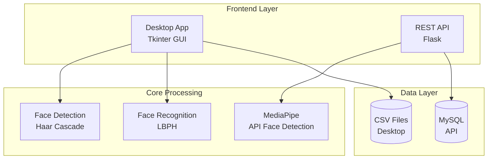
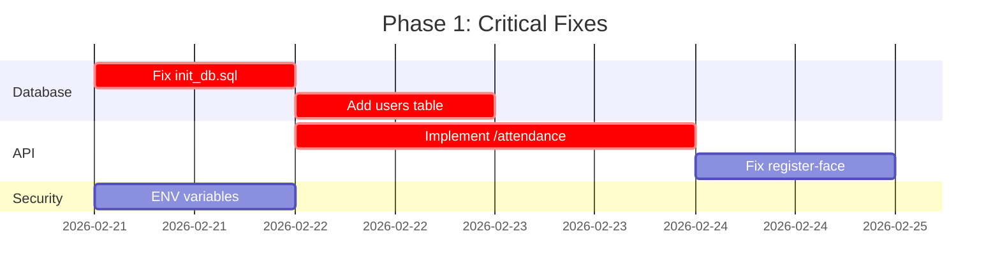

# BÁO CÁO ĐÁNH GIÁ DỰ ÁN
## Realtime Face Attendance System

**Ngày đánh giá**: 2026-02-21  
**Người thực hiện**: Architect Mode Analysis

---

## 1. TỔNG QUAN DỰ ÁN

### 1.1 Mô tả dự án
**Realtime Face Attendance System** là hệ thống điểm danh khuôn mặt thời gian thực sử dụng **OpenCV** và **LBPH Face Recognition**. Dự án cung cấp cả ứng dụng Desktop GUI và REST API cho việc theo dõi điểm danh.

### 1.2 Các thành phần chính



### 1.3 Cấu trúc thư mục
```
realtime-face-attendance/
├── codes/ultimate_system.py      # Desktop App (731 dòng)
├── deployment/api.py            # REST API (217 dòng)
├── model/Haarcascade.xml         # Model phát hiện khuôn mặt
├── TrainingImage/                # Ảnh khuôn mặt training
├── TrainingImageLabel/          # Model đã train (91MB)
├── Attendance/                   # CSV điểm danh
├── database/init_db.sql         # Schema database
├── docs/                         # Tài liệu
├── requirements.txt              # Dependencies
└── README.md                     # Hướng dẫn
```

---

## 2. PHÂN TÍCH CÁC THÀNH PHẦN

### 2.1 Desktop Application (`codes/ultimate_system.py`)

| Thành phần | Mô tả | Đánh giá |
|------------|-------|----------|
| **GUI Framework** | Tkinter với dark theme | ✅ Tốt |
| **4 Tabs** | Register, Train, Attendance, Database | ✅ Hợp lý |
| **Face Detection** | Haar Cascade Classifier | ✅ Hoạt động |
| **Face Recognition** | LBPH Face Recognizer | ✅ Hoạt động |
| **Threading** | Background camera processing | ✅ Tốt |
| **CSV Export** | Daily attendance files | ✅ Hoạt động |

**Điểm mạnh:**
- Code có cấu trúc rõ ràng, class-based
- Xử lý đa luồng (threading) tốt
- UI dark theme đẹp, nhất quán
- Tự tạo thư mục khi khởi động

### 2.2 REST API (`deployment/api.py`)

| Endpoint | Method | Trạng thái | Đánh giá |
|----------|--------|------------|----------|
| `/api/login` | POST | ✅ Hoạt động | Cơ bản |
| `/api/register-face` | POST | ⚠️ Partial | Chỉ lưu ảnh, thiếu logic |
| `/api/attendance` | POST | ❌ Incomplete | Chỉ trả về message |
| `/api/health` | GET | ✅ Hoạt động | Tốt |

### 2.3 Database Schema

**Vấn đề nghiêm trọng:** Không nhất quán database giữa các thành phần:

| Component | Database | Table |
|-----------|----------|-------|
| `init_db.sql` | `Face_reco_fill` | Attendance |
| `deployment/api.py` | `face_attendance` (env) | users (expected but missing) |
| Desktop App | CSV Files | N/A |

---

## 3. ĐÁNH GIÁ TIẾN ĐỘ VÀ CHẤT LƯỢNG

### 3.1 Tiến độ thực hiện

| Giai đoạn | Trạng thái | Mức độ hoàn thành |
|-----------|-------------|-------------------|
| ✅ Research & Design | Hoàn thành | 100% |
| ✅ Desktop App Core | Hoàn thành | 95% |
| ✅ Face Detection | Hoàn thành | 100% |
| ✅ Face Recognition | Hoàn thành | 100% |
| ✅ REST API Basic | Hoàn thành | 60% |
| ⚠️ Database Integration | Đang phát triển | 40% |
| ⚠️ API Endpoints | Chưa hoàn thiện | 50% |
| ❌ Testing | Chưa có | 0% |
| ❌ Documentation | Cơ bản | 70% |

### 3.2 Chất lượng code - Thang điểm: 6/10

#### ✅ Điểm mạnh:
1. **Cấu trúc rõ ràng**: Class-based design, separation of concerns
2. **UI nhất quán**: Dark theme, typography thống nhất
3. **Xử lý lỗi cơ bản**: Try-except blocks
4. **Tài liệu tốt**: README, DEPLOYMENT, PROJECT_DOCUMENTATION đầy đủ

#### ❌ Vấn đề cần cải thiện:

**1. Database Inconsistency (CRITICAL)**
- `database/init_db.sql` tạo database `Face_reco_fill`
- `deployment/api.py` sử dụng biến `DB_NAME` = `face_attendance`
- Thiếu bảng `users` nhưng API login query bảng này

**2. API Incomplete (HIGH)**
- `/api/attendance` endpoint không có logic thực
- `/api/register-face` chỉ lưu file, không lưu thông tin sinh viên
- Thiếu validation cho student ID và name

**3. Code Quality Issues (MEDIUM)**
```python
# Hardcoded values
app.config['SECRET_KEY'] = 'your-secret-key-change-this'  # Dòng 32
filename = secure_filename(file.filename)  # Không kiểm tra trùng lặp

# Missing error handling
def check_password(password, hashed):
    return check_password_hash(hashed, password)  # Không handle exception
```

**4. Missing Components (MEDIUM)**
- ❌ Unit tests
- ❌ Integration tests
- ❌ API documentation (Swagger/OpenAPI)
- ❌ Configuration management (.env not properly used in desktop app)
- ❌ Logging thống nhất

---

## 4. ĐIỂM MẠNH CẦN DUY TRÌ

| STT | Điểm mạnh | Mô tả |
|-----|------------|-------|
| 1 | **UI/UX tốt** | Dark theme nhất quán, responsive |
| 2 | **Threading** | Xử lý camera mượt, không block UI |
| 3 | **Kiến trúc rõ ràng** | Tách biệt concerns, dễ maintain |
| 4 | **Tài liệu đầy đủ** | README, Deployment guide chi tiết |
| 5 | **Multi-platform** | Hỗ trợ Windows, macOS, Linux |
| 6 | **Dual mode** | Desktop App + REST API |

---

## 5. VẤN ĐỀ CẦN CẢI THIỆN

### 5.1 Vấn đề Critical (Cần fix ngay)

| # | Vấn đề | Ảnh hưởng | Giải pháp |
|---|--------|-----------|-----------|
| 1 | Database inconsistency | API không hoạt động | Thống nhất schema, thêm bảng users |
| 2 | `/api/attendance` incomplete | Không điểm danh được | Implement face recognition |
| 3 | Hardcoded SECRET_KEY | Bảo mật yếu | Sử dụng environment variables |

### 5.2 Vấn đề High Priority

| # | Vấn đề | Giải pháp |
|---|--------|-----------|
| 4 | Thiếu validation input | Thêm input validation |
| 5 | API không handle duplicate | Thêm logic kiểm tra trùng lặp |
| 6 | No error responses | Thêm proper error messages |

### 5.3 Vấn đề Medium Priority

| # | Vấn đề | Giải pháp |
|---|--------|-----------|
| 7 | Không có tests | Thêm pytest framework |
| 8 | Thiếu API docs | Thêm Swagger/OpenAPI |
| 9 | Logging không nhất quán | Sử dụng Python logging |

---

## 6. ĐỀ XUẤT CẢI TIẾN

### 6.1 Giai đoạn 1: Fix Critical Issues (Ưu tiên cao)



**Actions:**
1. **Fix database schema:**
   - Thống nhất database name = `face_attendance`
   - Thêm bảng `users` với columns: `id, username, password_hash, created_at`
   - Thêm bảng `students` với columns: `id, student_id, name, created_at`

2. **Complete API endpoints:**
   - `/api/register-face`: Lưu thông tin student vào database
   - `/api/attendance`: Thực hiện face recognition + lưu attendance

3. **Security:**
   - Sử dụng `os.getenv()` cho tất cả secrets
   - Validate environment variables at startup

### 6.2 Giai đoạn 2: Quality Improvements

| # | Cải tiến | Mô tả |
|---|----------|-------|
| 1 | **Add Tests** | Pytest cho cả Desktop App và API |
| 2 | **API Documentation** | Swagger/OpenAPI với flasgger |
| 3 | **Logging** | Structured logging với rotation |
| 4 | **Configuration** | YAML/JSON config files |

### 6.3 Giai đoạn 3: Advanced Features

| # | Tính năng | Mô tả |
|---|-----------|-------|
| 1 | **Real-time API** | WebSocket cho attendance real-time |
| 2 | **Multi-camera** | Hỗ trợ nhiều camera đồng thời |
| 3 | **Analytics Dashboard** | Thống kê attendance |
| 4 | **Export Options** | PDF, Excel reports |

---

## 7. KẾT LUẬN

### Tổng điểm: **6.5/10**

| Tiêu chí | Điểm |
|----------|-------|
| Chức năng cơ bản | 8/10 |
| Chất lượng code | 6/10 |
| Tài liệu | 8/10 |
| Bảo mật | 4/10 |
| Testing | 0/10 |
| Khả năng mở rộng | 5/10 |

### Khuyến nghị:
1. ✅ **Tiếp tục phát triển** - Dự án có nền tảng tốt
2. ⚠️ **Ưu tiên fix Critical issues** trước khi deploy production
3. 📝 **Thêm testing** trước khi thêm features mới
4. 🔒 **Cải thiện bảo mật** trước khi public release

---

**Báo cáo được tạo bởi:** Architect Mode Analysis  
**Ngày:** 2026-02-21
